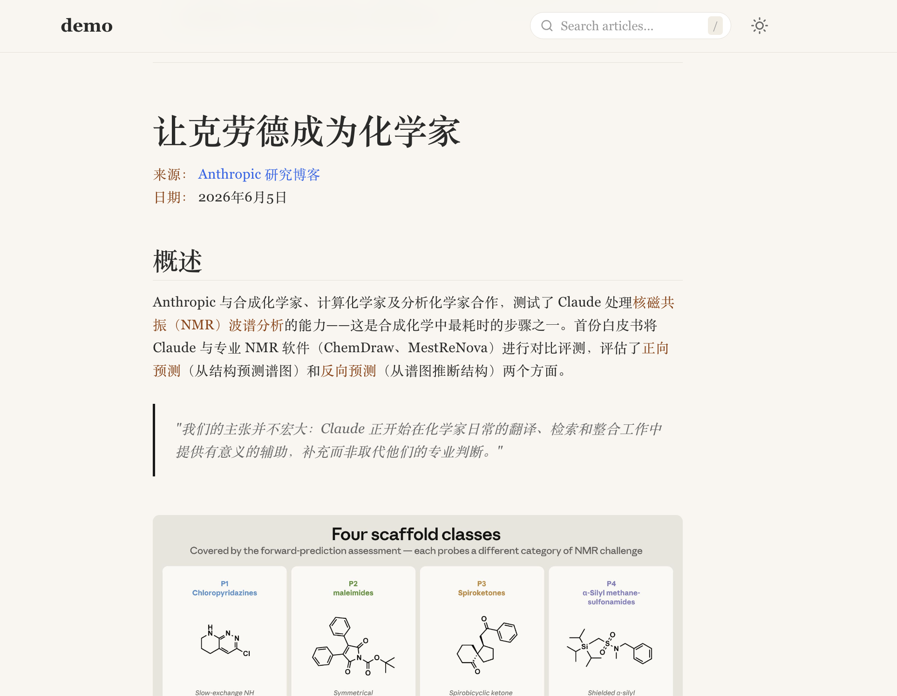

# Quro Notebook — Static Site Generator for Searchable Notebooks

> **From quro-doc documents to a self-contained, searchable static site.**

Quro Notebook is a static site generator that builds a searchable notebook from [quro-doc](https://github.com/anomalyco/quro-doc) documents. It has no runtime server — the build phase produces a fully self-contained static site served by any static file server.

---



---

## 1. What Quro Notebook Does

```
quro-doc Documents
        │
        ▼
┌────────────────────────────────────┐
│  ① Read                             │
│  ├─ Read quro-doc documents         │
│  └─ Extract metadata & content       │
├────────────────────────────────────┤
│  ② Render                           │
│  ├─ Markdown → HTML (mistune)       │
│  ├─ Jinja2 templating               │
│  └─ Inline page fragments            │
├────────────────────────────────────┤
│  ③ Embed (optional)                 │
│  ├─ sentence-transformers (BGE)     │
│  └─ Semantic vector generation       │
├────────────────────────────────────┤
│  ④ Write                            │
│  ├─ Single-file index.html          │
│  ├─ All pages as base64 fragments   │
│  ├─ minisearch index                │
│  ├─ CDN assets (localized)          │
│  └─ Multi-style visual theming      │
└────────────────────────────────────┘
         │
         ▼
   Static Site (_output/)
```

### Concrete Outputs

| Output | Description |
|--------|-------------|
| `index.html` | Self-contained static site with embedded pages |
| `index.json` | Search index (MiniSearch-compatible) |
| `assets/js/` | MiniSearch, Transformers.js (localized CDN) |
| `assets/css/` | Theme + per-style CSS variable overrides |
| `assets/fonts/` | Google Fonts (localized, optional) |

---

## 2. Quick Start

### Prerequisites

- Python >= 3.13
- `quro-doc` installed and configured

### Multi-Tenancy

Quro Notebook supports multi-tenancy via quro-doc's project namespace. Use `--project <name>` to target a specific project, which resolves `QURO_STORAGE_ROOT` to `<storage_root>/projects/<name>`.

### Installation

```bash
# Clone the repository
git clone <repo-url> quro-notebook
cd quro-notebook

# Install dependencies
uv pip install -e .
```

### Usage

```bash
# Build static site for a specific project
quro-notebook --project <project-name> build [--style warm-editorial] [--skip-embeddings]

# Example
quro-notebook --project quro-demo build --style warm-editorial

# Build with explicit paths (overrides project default)
quro-notebook build <project_root> <output_dir>

# Pre-fetch CDN assets (subcommand)
quro-notebook fetch-assets
quro-notebook fetch-assets --list    # Show cache status

# Run search server
quro-notebook search-server --port 8765

# Serve built site locally
python -m http.server -d _output
```

### Available Options (for `build`)

| Flag | Description |
|------|-------------|
| `--project <name>` | Target project for multi-tenant setups (top-level flag, before `build`) |
| `--skip-embeddings` | Skip vector embedding generation |
| `--no-fonts` | Skip Google Fonts localization |
| `--embed-api URL` | Custom embedding API endpoint |
| `--quro-search URL` | Custom quro-doc search server URL |
| `--style NAME` | Visual style (default, warm-editorial) |
| `--model-name MODEL` | Embedding model name (default: `BAAI/bge-small-en-v1.5`) |

---

## 3. Build Pipeline

```
build.py (orchestrator)
  ├── reader.py      →  quro-doc read adapter
  ├── renderer.py    →  Markdown → HTML (mistune + jinja2)
  ├── embedder.py    →  Vector embeddings (optional)
  └── writer.py      →  Output to _output/
       ├── assets.py      CDN fetch & cache
       └── fetcher.py     Download helpers
```

| Module | Responsibility |
|--------|---------------|
| `build.py` | Orchestrator — coordinates the pipeline |
| `reader.py` | Reads quro-doc documents (read-only adapter) |
| `renderer.py` | Pure string→string Markdown to HTML conversion |
| `embedder.py` | Optional semantic vector embedding (BGE model) |
| `writer.py` | Sole writer to `_output/` — templates, assets, index |
| `assets.py` | CDN asset fetch with disk cache |
| `fetcher.py` | Thin download wrappers |
| `schemas.py` | Dataclasses (zero internal imports) |
| `search_server.py` | HTTP bridge for quro-doc search |
| `file_index.py` | Local file stem→path index |

---

## 4. Key Features

- **Self-contained** — All page HTML is embedded as base64 `<script>` fragments in `index.html`; no server required at runtime.
- **Client-side search** — Full-text search via MiniSearch, optional semantic search via Transformers.js.
- **Multi-style theming** — CSS variable overrides per style (default, warm-editorial). Easily extensible.
- **CDN asset caching** — XDG-compliant cache (`~/.cache/quro-notebook/cdn/`). Works offline after first fetch.
- **Optional embeddings** — Gracefully skips vector generation when `sentence-transformers` is unavailable.
- **Zero-config static serving** — Output is plain HTML/JS/CSS; works with any static file server.

---

## 5. Project Structure

```
├── templates/            # HTML/CSS/JS templates
│   ├── index.html
│   ├── app.js
│   ├── search.js
│   ├── theme.css
│   └── styles/           # Per-style CSS variable overrides
├── src/quro_notebook/    # Python build pipeline
│   ├── build.py
│   ├── reader.py
│   ├── renderer.py
│   ├── embedder.py
│   ├── writer.py
│   ├── schemas.py
│   ├── assets.py
│   ├── fetcher.py
│   ├── file_index.py
│   ├── search_server.py
│   └── cli.py
└── _output/              # Build output (gitignored)
```

---

## 6. License

This project is released under the **Unlicense** — free and unencumbered software released into the public domain.

See [LICENSE.txt](LICENSE.txt) for the full text.

---

## 7. Disclaimer

This software is provided "as is", without warranty of any kind, express or implied. Since all code is generated by AI, the authors have not performed comprehensive production testing. Users assume all risks, losses, or data corruption resulting from running this software. The authors assume no legal liability for the accuracy, security, or fitness of the code.

---

## 8. Acknowledgments

This project is entirely AI-driven. Thanks to the following large language models that provided core ideas, architecture design, and all code implementation (in no particular order):

* **Claude**
* **Gemini**
* **ChatGPT**
* **DeepSeek**
* **GLM**

Thanks to the above technologies for their major contributions to this project.
